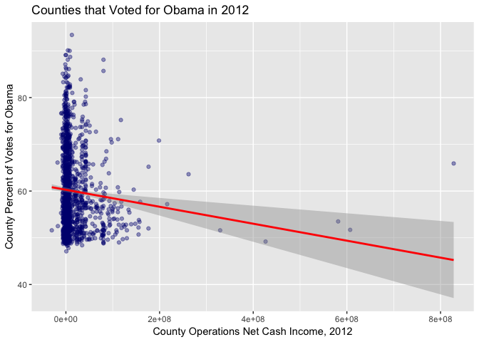

Farmer Votes in 2012 Presidential Elections
================
Quinn Keck
4/14/2019

Data comes from joining the 2012 U.S. Census of Agriculture data with US 2012 election county-level data.

2012 U.S. Census of Agriculture data: <https://www.nass.usda.gov/Publications/AgCensus/2012/Online_Resources/Ag_Census_Web_Maps/Data_download/Ag_Census_Map_data_07172015.xlsx>

The Guardian's Full US 2012 election county-level data: <https://www.theguardian.com/news/datablog/2012/nov/07/us-2012-election-county-results-download>

EDA
===

`votes_income = read_csv("votes_income_party_string.csv")`

``` r
head(votes_income)
```

    ## # A tibble: 6 x 18
    ##      X1 Operations_net_… Operations_inco… Operators_net_c… Operators_incom…
    ##   <int>            <dbl>            <dbl>            <dbl>            <dbl>
    ## 1     0          4453099            11448          4114437            10577
    ## 2     1         33784853            34161         33785241            34161
    ## 3     2         24690157            43240         14643186            25645
    ## 4     3           218327             1155           175670              929
    ## 5     4         30328280            24439          7141638             5755
    ## 6     5         16144140            59136         14183763            51955
    ## # ... with 13 more variables: FIPS <int>, FIPSTEXT <int>,
    ## #   CountyName <chr>, Entity <chr>, StateName <chr>, `State Postal` <chr>,
    ## #   `County Name` <chr>, Obama_vote <dbl>, Obama_vote_percent <dbl>,
    ## #   Romney_vote <dbl>, Romney_vote_percent <dbl>, d_state <int>,
    ## #   Party <chr>

``` r
# Vote Count vs Operations net
votes_lm <- lm(Obama_vote ~ Operations_net_cash_income_2012, data = votes_income)
summary(votes_lm)
```

    ## 
    ## Call:
    ## lm(formula = Obama_vote ~ Operations_net_cash_income_2012, data = votes_income)
    ## 
    ## Residuals:
    ##     Min      1Q  Median      3Q     Max 
    ##  -19207  -11431   -9922   -5680 1660534 
    ## 
    ## Coefficients:
    ##                                  Estimate Std. Error t value Pr(>|t|)    
    ## (Intercept)                     1.175e+04  9.418e+02  12.473   <2e-16 ***
    ## Operations_net_cash_income_2012 2.736e-05  1.711e-05   1.599     0.11    
    ## ---
    ## Signif. codes:  0 '***' 0.001 '**' 0.01 '*' 0.05 '.' 0.1 ' ' 1
    ## 
    ## Residual standard error: 53150 on 3964 degrees of freedom
    ## Multiple R-squared:  0.0006448,  Adjusted R-squared:  0.0003927 
    ## F-statistic: 2.558 on 1 and 3964 DF,  p-value: 0.1098

``` r
votes_lm <- lm(Obama_vote_percent ~ Operators_net_cash_income_2012, data = votes_income)
summary(votes_lm)
```

    ## 
    ## Call:
    ## lm(formula = Obama_vote_percent ~ Operators_net_cash_income_2012, 
    ##     data = votes_income)
    ## 
    ## Residuals:
    ##     Min      1Q  Median      3Q     Max 
    ## -40.768 -11.696   0.346  10.513  49.424 
    ## 
    ## Coefficients:
    ##                                  Estimate Std. Error t value Pr(>|t|)    
    ## (Intercept)                     4.418e+01  2.732e-01 161.722  < 2e-16 ***
    ## Operators_net_cash_income_2012 -1.625e-08  5.424e-09  -2.997  0.00275 ** 
    ## ---
    ## Signif. codes:  0 '***' 0.001 '**' 0.01 '*' 0.05 '.' 0.1 ' ' 1
    ## 
    ## Residual standard error: 15.6 on 3964 degrees of freedom
    ## Multiple R-squared:  0.00226,    Adjusted R-squared:  0.002009 
    ## F-statistic:  8.98 on 1 and 3964 DF,  p-value: 0.002746

``` r
democats <- votes_income %>%
  filter(d_state==1)

republicans <- votes_income %>%
  filter(d_state==0)
```

``` r
d_votes_lm <- lm(Obama_vote_percent ~ Operations_net_cash_income_2012, data = democats)
summary(d_votes_lm)
```

    ## 
    ## Call:
    ## lm(formula = Obama_vote_percent ~ Operations_net_cash_income_2012, 
    ##     data = democats)
    ## 
    ## Residuals:
    ##     Min      1Q  Median      3Q     Max 
    ## -13.155  -6.824  -2.042   5.076  33.361 
    ## 
    ## Coefficients:
    ##                                   Estimate Std. Error t value Pr(>|t|)    
    ## (Intercept)                      6.027e+01  2.420e-01 249.086  < 2e-16 ***
    ## Operations_net_cash_income_2012 -1.815e-08  5.111e-09  -3.551 0.000395 ***
    ## ---
    ## Signif. codes:  0 '***' 0.001 '**' 0.01 '*' 0.05 '.' 0.1 ' ' 1
    ## 
    ## Residual standard error: 8.678 on 1476 degrees of freedom
    ## Multiple R-squared:  0.008472,   Adjusted R-squared:  0.007801 
    ## F-statistic: 12.61 on 1 and 1476 DF,  p-value: 0.0003953

``` r
ggplot(democats, aes(x = Operations_net_cash_income_2012, y = Obama_vote_percent)) + 
  geom_point(color='navy', alpha=0.4) +
  stat_smooth(method = "lm", col = "red")+
    labs(title = "Counties that Voted for Obama in 2012",
       x = "County Operations Net Cash Income, 2012", y = "County Percent of Votes for Obama") 
```



``` r
r_votes_lm <- lm(Obama_vote_percent ~ Operations_income_avg_per_farm_2012, data = republicans)
summary(d_votes_lm)
```

    ## 
    ## Call:
    ## lm(formula = Obama_vote_percent ~ Operations_net_cash_income_2012, 
    ##     data = democats)
    ## 
    ## Residuals:
    ##     Min      1Q  Median      3Q     Max 
    ## -13.155  -6.824  -2.042   5.076  33.361 
    ## 
    ## Coefficients:
    ##                                   Estimate Std. Error t value Pr(>|t|)    
    ## (Intercept)                      6.027e+01  2.420e-01 249.086  < 2e-16 ***
    ## Operations_net_cash_income_2012 -1.815e-08  5.111e-09  -3.551 0.000395 ***
    ## ---
    ## Signif. codes:  0 '***' 0.001 '**' 0.01 '*' 0.05 '.' 0.1 ' ' 1
    ## 
    ## Residual standard error: 8.678 on 1476 degrees of freedom
    ## Multiple R-squared:  0.008472,   Adjusted R-squared:  0.007801 
    ## F-statistic: 12.61 on 1 and 1476 DF,  p-value: 0.0003953

``` r
ggplot(republicans, aes(x = Operations_net_cash_income_2012, y = Obama_vote_percent)) + 
  geom_point(color='navy', alpha=0.4) +
  stat_smooth(method = "lm", col = "red") +
  labs(title = "Counties that Voted for Romney in 2012",
       x = "County Operations Net Cash Income, 2012", y = "County Percent of Votes for Obama") 
```


Graphs
======

``` r
# Colored by whether a county voted for Obama or Romney 

boolColors <- as.character(c("Democrat"="blue3", "Republican"="red1"))
boolScale <- scale_colour_manual(name="myboolean", values=boolColors)

fit <- lm(Obama_vote_percent ~ Operations_income_avg_per_farm_2012, data = votes_income)

ggplot(votes_income, aes(x = Operations_income_avg_per_farm_2012, y = Obama_vote_percent)) + 
  geom_point(aes(color = Party), alpha=0.4) +
  boolScale +
  stat_smooth(method = "lm", col = "black") +
  theme(legend.title=element_blank()) +
   labs(title = "Average Farmer Income Predicts County's Percent of Votes For Obama in 2012",
       subtitle = paste("Intercept =",signif(fit$coef[[1]],5 ),
                     " Slope =",signif(fit$coef[[2]], 5),
                     " P =",signif(summary(fit)$coef[2,4], 5)),
       x = "County Average Net Cash Income per Farmer, 2012", y = "County Percent of Votes for Obama") 
```


``` r
boolColors <- as.character(c("Democrat"="blue3", "Republican"="red1"))
boolScale <- scale_colour_manual(name="myboolean", values=boolColors)

fit <- lm(Obama_vote_percent ~ Operations_income_avg_per_farm_2012, data = votes_income)

ggplot(votes_income, aes(x = Operations_income_avg_per_farm_2012, y = Obama_vote_percent)) + 
  geom_point(color='red', alpha = 0.3) +
  boolScale +
  stat_smooth(method = "lm", col = "black") +
  theme(legend.title=element_blank()) +
   labs(title = "Average Farmer Income Predicts County's Percent of Votes For Obama in 2012",
       subtitle = paste("Intercept =",signif(fit$coef[[1]],5 ),
                     " Slope =",signif(fit$coef[[2]], 5),
                     " P =",signif(summary(fit)$coef[2,4], 5)),
       x = "County Average Net Cash Income per Farmer, 2012", y = "County Percent of Votes for Obama") 
```


More information on the farmer vote: <https://newfoodeconomy.org/rural-trump-vote-democrat-farm-policy/>
