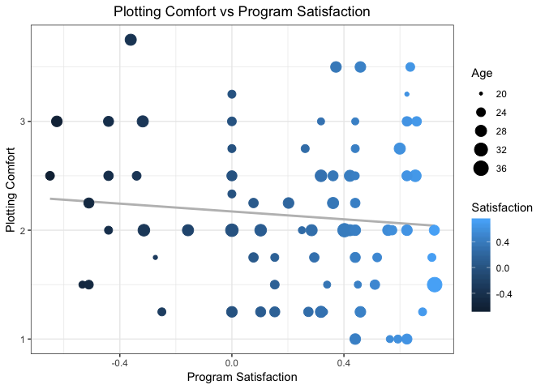
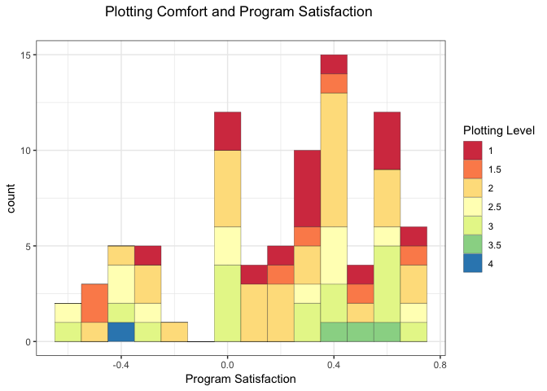
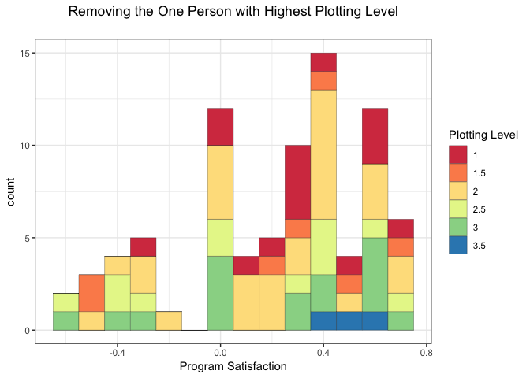

Graphs of Classmates Survey
================
Quinn Keck
3/20/2019

``` python
import pandas as pd
import numpy as np
from vaderSentiment.vaderSentiment import SentimentIntensityAnalyzer

analyser = SentimentIntensityAnalyzer()

def sentiment_analyzer_scores(sentence):
    score = analyser.polarity_scores(sentence)
    return score
    
classmates = pd.read_csv("Copy of Data Visualization Survey (Both sections) (Responses)_Quinn - Form Responses 1.csv")  ## responces to classmates survey

# Sentiment Scores 
program_neg = []
program_neu = []
program_pos = []
program_compound = []
sentences = list(classmates['In one sentence describe how you feel about this program. (for sentiment analysis)'])

for sentence in sentences:
    score = sentiment_analyzer_scores(sentence)
    program_neg.append(score['neg'])
    program_neu.append(score['neu'])
    program_pos.append(score['pos'])
    program_compound.append(score['compound'])
    
classmates['program_pos'] = program_pos
classmates['program_neg'] = program_neg
classmates['program_neu'] = program_neu
classmates['program_compound'] = program_compound

classmates['Which programming language are you most comfortable using to make data visualizations?'] = classmates['Which programming language are you most comfortable using to make data visualizations?'].fillna('missing')

lang = list(classmates['Which programming language are you most comfortable using to make data visualizations?'])
classmates['language'] = [s.strip().lower() for s in lang]

# Calculate Average Plotting Comfort

col = classmates.loc[: , ['How difficult is it for you to make a barplot?',
       'How difficult is it for you to make a boxplot?',
       'How difficult is it for you to make a line graph?',
       'How difficult is it for you to make a stacked area graph?']]

classmates['avg_plotting_comfort']  = col.mean(axis=1)

classmates['Age']  = classmates['How old are you?']
classmates['Program Satisfaction'] = classmates['program_compound']
classmates['Plotting Comfort'] = classmates['avg_plotting_comfort']
# Binning
classmates['Plotting_Level'] = [round(x*2)/2 for x in classmates['avg_plotting_comfort']]

classmates.to_csv("classmates_new.csv")
```

``` r
  theme_set(theme_bw()) 
ggplot(classmates, aes(x = `Program Satisfaction`, y = `Plotting Comfort`, color=`Satisfaction`)) +
  geom_smooth(method=lm, se=FALSE, color = 'gray') +
  geom_point() +
  geom_point(aes(size= Age)) + 
  ggtitle("Plotting Comfort vs Program Satisfaction") +
  theme(plot.title = element_text(hjust = 0.5))
```



``` r
theme_set(theme_bw()) 

classmates$`Plotting Level` <- as.factor(classmates$`Plotting Level`)

ggplot(classmates, aes(`Program Satisfaction`)) + 
scale_fill_brewer(palette = "Spectral") + 
  geom_histogram(aes(fill=`Plotting Level`), 
                   binwidth = .1, 
                   col="black", 
                   size=.1) +
  ggtitle("Plotting Comfort and Program Satisfaction \n") +
  theme(plot.title = element_text(hjust = 0.5)) 
```



``` r
# remove outlier (single classmate in 4 plotting level)
classmates %>%
  filter(`Plotting Level` != '4') %>%
ggplot(aes(`Program Satisfaction`)) + 
scale_fill_brewer(palette = "Spectral") + 
  geom_histogram(aes(fill=`Plotting Level`), 
                   binwidth = .1, 
                   col="black", 
                   size=.1) +
  ggtitle("Removing the One Person with Highest Plotting Level\n") +
  theme(plot.title = element_text(hjust = 0.5)) 
```



sources:

<http://r-statistics.co/Top50-Ggplot2-Visualizations-MasterList-R-Code.html> <https://stackoverflow.com/questions/40675778/center-plot-title-in-ggplot2> <http://r-statistics.co/Top50-Ggplot2-Visualizations-MasterList-R-Code.html>
