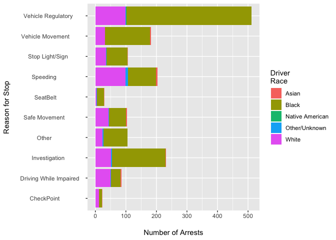
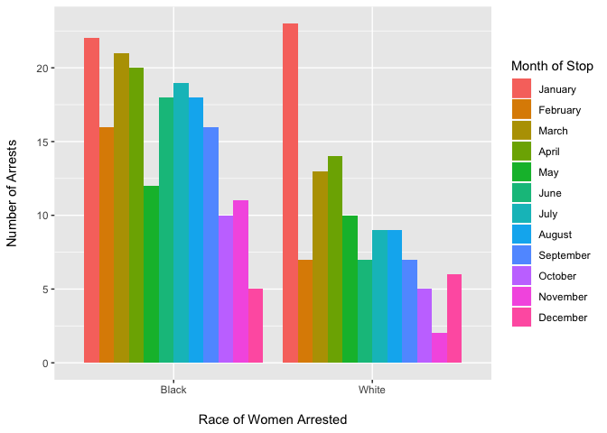

Charlotte Officer Traffic Stops
================
Quinn Keck
May 31, 2019

Introduction
============

Officer\_Traffic\_Stops.csv is a record of traffic stops by police officers in Charlotte, North Carolina and can be accessed at <https://charlottenc.gov/CMPD/Pages/Resources/OpenData_Source.aspx>. The data in this analysis is from January 2016 to December 2016. Under North Carolina state law, all law enforcement agencies are required to collect information on all traffic stops and report this information to the North Carolina Department of Justice.

Unsurprisingly, Black drivers are stopped most frequently for any reason in Charlotte. Vehicle regulatory stops had the most disproportionate number of black drivers stopped, while check points were the most evenly distributed. Perhaps this is because police officers would stop drivers at random at check points but choose who they would pull over for other stops.

Looking at the data on a per month basis and comparing distribution of black and white women drivers to the distribution of all drivers, interesting patterns emerge. The peak months for arrests between blacks and whites do not coincide as one might expect. Perhaps the particularly higher rate of black driver arrests in April correlated with local or national events. The distribution of arrests rates takes on a different shape when only looking at black and white female drivers and demonstrates the intersectionality between racism and gender. This data only includes male and female gender labels, and it is likely there were gender non-conforming people in the 79,884 observations that were coded incorrectly. The racial basis of officers may affect them differently as well.

Officers with the least years of experience tend to arrest black drivers in their mid-twenties at a significantly higher rate than any other group. As years of experience increases, however, officers arrest black drivers of all ages at a more uniform rate. This discrepancy seems rather high to be due to chance alone and could reflect a particularly high basis that white officers are coming in with and or a high amount of turnover among officers so that there are far fewer officers with many years of experience. Further study of more years of data to see if these patterns are consistent over time would provide more insights. It is also notable that the CMPD website says the department conducts an estimated 120,000 stops per year, but this data set only includes 79,884 observations, and those missing observations could affect these findings. There is nonetheless a clear bias of officers towards black drivers, particularly black male drivers, that needs to change.
