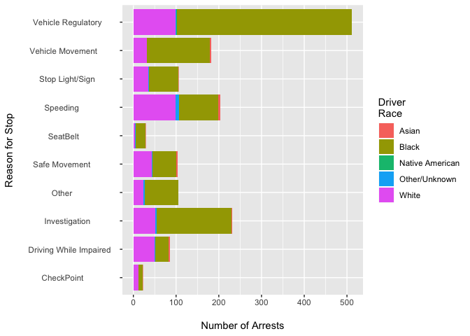
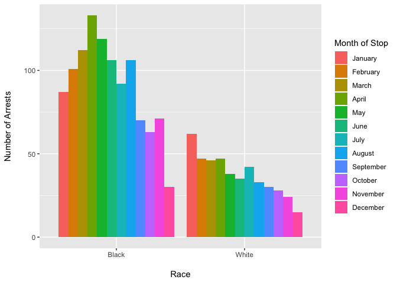
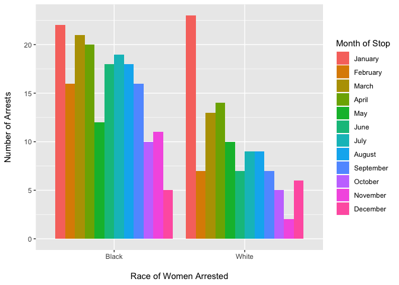
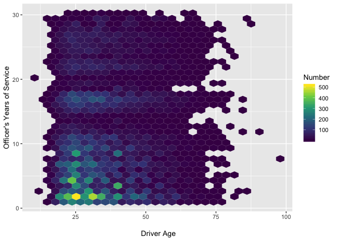

Officer Traffic Stops
================
Quinn Keck
Thursday, August 7th, 2018

`Officer_Traffic_Stops.csv` is a record of traffic stops by police officers in Charlotte, North Carolina.

Figure 1 

Arrests, as one would probably assume without even looking at the data set, are highest among black drivers. They were by far the highest for any reason of the arrest, but astronomically high for vehicle regulatory stops. Perhaps that is the easiest reason for the officer to pull people over without their rationale being questioned. It is also notable that the only category in which it appears black and white drivers are stopped somewhat equally is at a check point, which would make sense because officers don't choose who they stop at a check point.

Figure 2 

One would naturally expect a higher rate of blacks arrested when the data is examined one per month basis. However, what is unexpected is that the peak months for arrests between blacks and whites do not coincide. If arrest rates where simply higher among blacks overall, one could expect the count of arrests per month to be more uniform between the two groups. I would wonder if the particularly higher rate of black driver arrests in April correlated with any local or national events. If the correlation were true, it would further suggest basis in arresting officers is present and changeable.

Figure 2.2

Arrest rates between black women and white women had different peak months then the general population, though this is possibly due to the lower sample size. It is also interesting that on a per month basis, more black women are arrested than white women, but the discrepancy is far less severe than with the whole population. In January more white women were arrested, perhaps there was some local event that caused this spike. It could indicate that the racial basis effects black women and black men differently. Black men may be viewed as more of a threat to officers, thus the bigger difference in the rates of arrest between black drivers and white drivers in general compared to female drivers. I also wonder if there were any trans and gender non-conforming people in 79,884 observations that were coded incorrectly, if there was a large enough sample of trans and gender non-conforming people, I suspect the racial basis of officers may effect them differently as well.

Figure 3

Officers with the least years of experience tend to arrest black drivers in their mid-twenties at an significantly higher rate then any other group. As years of experience increases, however, officers arrest black drivers of all ages at a more uniform rate. This discrepancy seems rather high to be due to chance, and I would wonder if this reflects a basis that white officers are coming in with and may change as they work longer, or is due to other factors. It would be useful to devise a randomized experiment where cops are asked if they would pull people over, arrest them, etc, in different situations while not knowing the researcher was looking for racial basis. It would also be interesting to look in the 2017 data, and see if there were shifts in rates due to national events like the Charlottesville, Virginia protest. It is also notable that the CMPD website says the department conducts an estimated 120,000 stops per year, but this data set only includes 79,884 observations (<http://charlottenc.gov/CMPD/Pages/Resources/OpenData_Source.aspx>). I wonder if the missing observations would change the data significantly.
